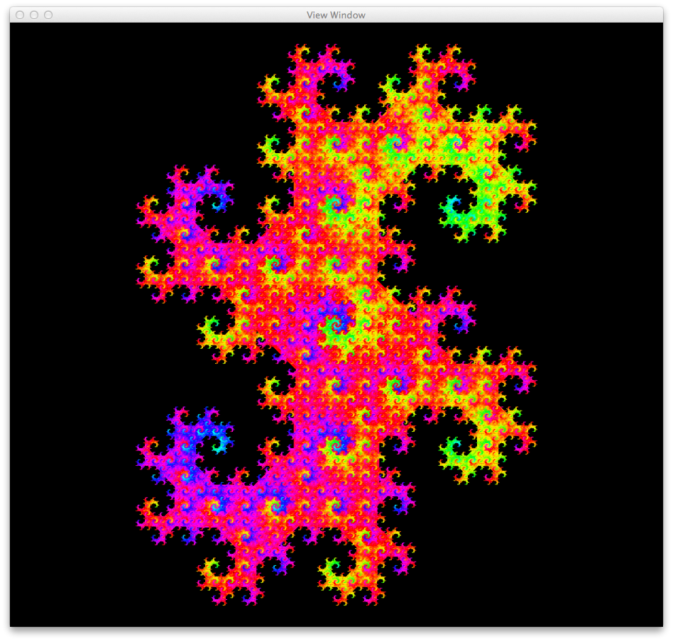
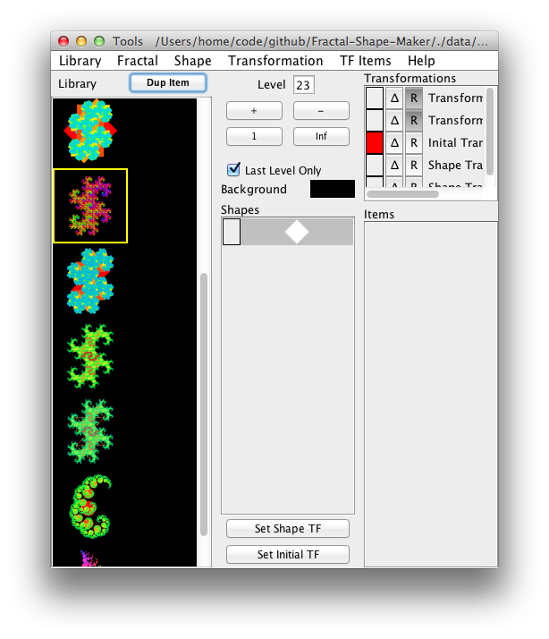

Fractal-Shape-Maker
===================

This a program that makes fractals by recursively copying and
warping simple shapes. The shapes are circle, square,and triangle. The
transformations are scale, translate, and rotate. Shapes can increment
their hue depending on the transformation. Shapes can also be
transparent. Fractals can also be printed at printer resolution.
Settings are saved as xml.

 

 

